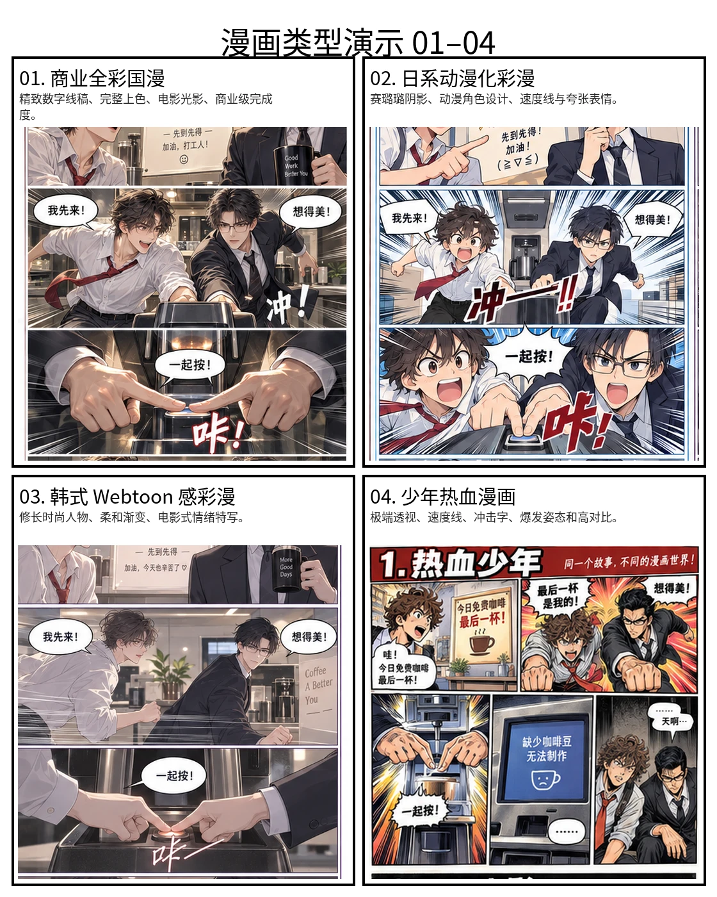
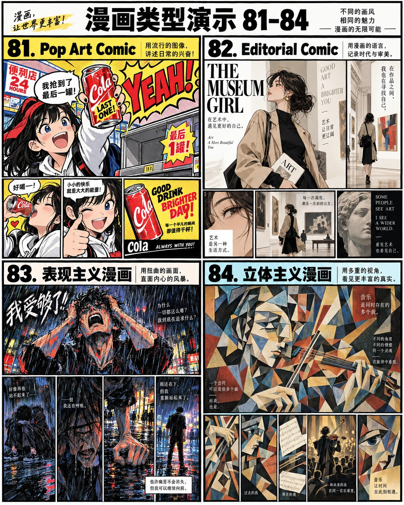

# 漫画风格 × 分镜机制

> 别再只写“国漫风”了。把风格和分镜编号交给 Codex，一句话出一页漫画。

## 怎么用

1. 把仓库链接发给 Codex：<https://github.com/yang0/manhua>
2. 直接说：`风格 36，分镜 79，主题：雨夜山寺重逢`

120 种风格 × 80 种分镜，可自由组合。

| 漫画风格 | 漫画风格 |
| --- | --- |
|  |  |
| 分镜机制 | 分镜机制 |
|  |  |

𝕏 [@yang02010](https://x.com/yang02010)
